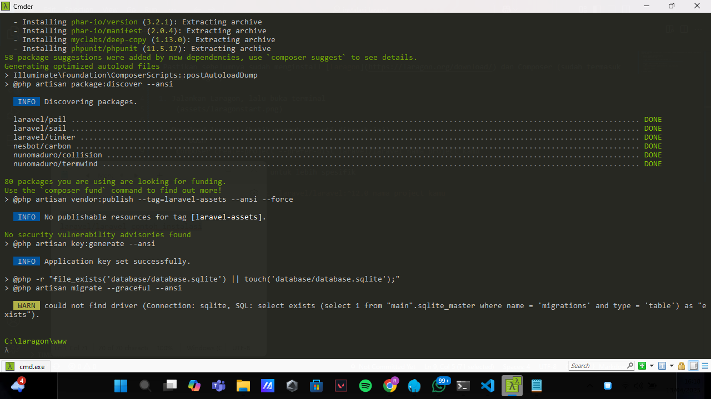

# Instalasi Laravel menggunakan Laragon dan Composer
 Pastikan sebelumnya sudah menginstall [Laragon](https://laragon.org/download/) dan Composer (sudah termasuk dalam Laragon)

1. Jalankan Laragon, lalu buka terminal
    

2. Download laravel (ketik prompt seperti dibawah ini)
    ```bash
    composer create-project --prefer-dist laravel/laravel nama_project
    ```

    atau bisa seperti ini untuk lebih spesifik 
    ```bash
    composer create-project laravel/laravel:^12.0 nama_project
    ```
    Tunggu proses selesai
     

3. Buka direktori Laravel 
    ```bash 
    cd nama_project
    ```

4. Buka text editor
    ```bash
    code .
    ```
    
    
5. Untuk menjalankan project ketik prompt dibawah ini
    ```bash
    php artisan serve
    ```
    

6. Laravel sudah berjalan di localhost
    
